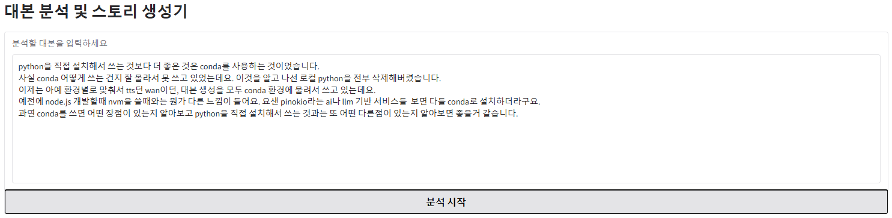
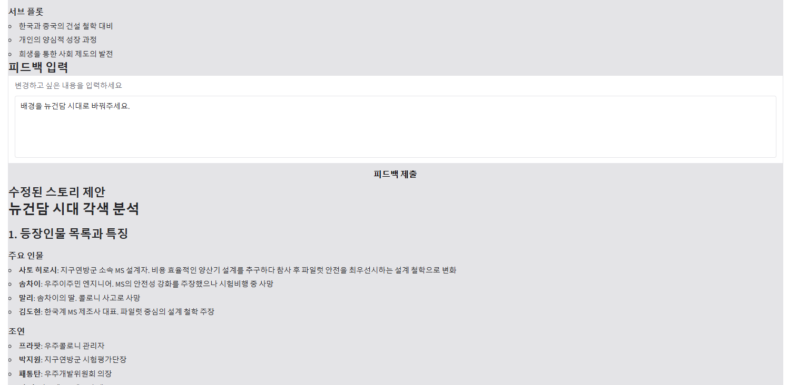
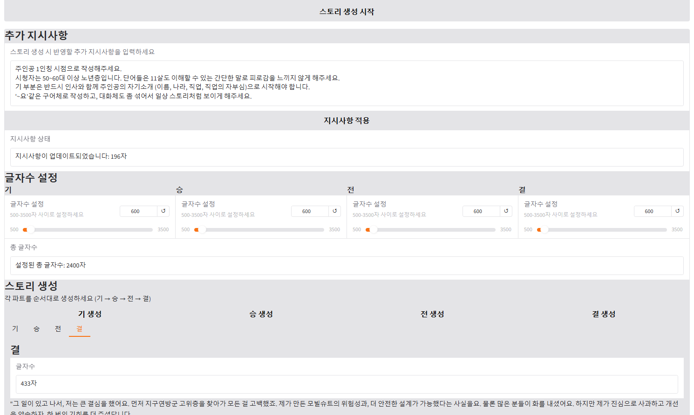

# 📚 대본 분석 및 스토리 생성기

AWS Bedrock의 Claude 3.5 Sonnet 모델을 활용한 대본 분석 및 기승전결 구조의 스토리 생성 애플리케이션입니다.

## ✨ 주요 기능

- 🔍 **대본 분석**: 입력된 대본의 등장인물, 구조, 테마를 분석
- 💬 **피드백 반영**: 분석 결과에 사용자 피드백을 반영한 스토리 제안
- 📝 **기승전결 스토리 생성**: 각 파트별로 독립적인 스토리 생성
- ⚙️ **글자수 커스터마이징**: 각 파트별 글자수를 500-3500자 사이로 조절 가능
- 📋 **추가 지시사항**: 스토리 생성 시 반영할 추가 지시사항 입력 가능

## 🛠️ 설치 및 환경 설정

### 필수 요구사항

- Python 3.8 이상
- AWS 계정 (Bedrock 서비스 액세스 권한 필요)
- AWS CLI 설정 및 프로필 구성
- Claude 3.5 Sonnet 모델 사용 권한 (ap-northeast-2 리전)
- Claude 3.7 Sonnet의 경우 버지니아 리전에서만 지원합니다. (us-east-1 리전)

### 설치 방법

1. 저장소 클론 또는 다운로드

```bash
git clone [저장소 주소]
cd [프로젝트 폴더]
```

2. 필요한 패키지 설치

```bash
pip install gradio boto3
```

3. AWS CLI 프로필 설정 (아직 설정하지 않은 경우)

```bash
aws configure --profile sso
```
아래 정보를 입력합니다:
- AWS Access Key ID
- AWS Secret Access Key
- Default region name (ap-northeast-2 권장)
- Default output format (json 권장)


하지만 Access Key 또는 Secret 유출이 될 수 있어 직접적인 키를 넣고 실행하는 것이 아닌 sso login을 이용하여 하실 것을 강력히 권장합니다.
```bash
aws sso login
```

## ⚠️ 중요 설정 사항

### AWS Bedrock 모델 액세스

애플리케이션이 제대로 작동하려면 다음 조건이 충족되어야 합니다:

1. **AWS SSO 프로필 설정**: 코드에서 `profile_name='sso'`로 지정되어 있으므로, AWS CLI에서 이 이름의 프로필이 설정되어 있어야 합니다. (필요시 직접 수정가능)

2. **Claude 3.5 Sonnet 모델 액세스**: AWS 계정에서 "apac.anthropic.claude-3-5-sonnet-20241022-v2:0" 모델에 대한 액세스 권한이 필요합니다. (필요시 직접 수정 가능)

3. **리전 확인**: `ap-northeast-2` (서울) 리전을 사용합니다. 다른 리전을 사용하려면 코드에서 변경해야 합니다.

### 모델 ID 변경 방법

다른 모델을 사용하려면 `app.py` 파일에서 다음 부분을 수정하세요:

```python
response = bedrock.invoke_model(
    modelId="apac.anthropic.claude-3-5-sonnet-20241022-v2:0",  # 이 부분을 변경
    body=json.dumps({
        "anthropic_version": "bedrock-2023-05-31",
        "max_tokens": 4096,
        "temperature": 0.7,
        "messages": [
            {
                "role": "user",
                "content": prompt
            }
        ]
    })
)
```

## 🚀 실행 방법

프로젝트 폴더에서 다음 명령어를 실행합니다:

```bash
python app.py
```

서버가 시작되면 `http://127.0.0.1:7860` 또는 터미널에 표시되는 URL로 접속할 수 있습니다.

## 💻 사용 방법

1. **대본 분석**
   - 텍스트 영역에 분석할 대본을 입력합니다.
   - "분석 시작" 버튼을 클릭합니다.
   - 등장인물, 구조, 테마 등 분석 결과가 표시됩니다.

2. **피드백 제공**
   - 분석 결과를 바탕으로 수정하고 싶은 내용을 입력합니다.
   - "피드백 제출" 버튼을 클릭합니다.
   - 수정된 스토리 제안이 표시됩니다.
   - "스토리 생성 시작" 버튼을 클릭하여 다음 단계로 진행합니다.

3. **스토리 생성 설정**
   - 각 파트(기, 승, 전, 결)의 글자수를 슬라이더로 조정합니다.
   - 필요한 경우 추가 지시사항을 입력하고 "지시사항 적용" 버튼을 클릭합니다.

4. **스토리 생성**
   - "기 생성", "승 생성", "전 생성", "결 생성" 버튼을 순서대로 클릭하여 스토리를 생성합니다.
   - 각 탭에서 생성된 내용을 확인할 수 있습니다.

## 📸 데모 스크린샷

### 대본 분석 화면


### 피드백 입력 화면


### 스토리 생성 화면


## ❗ 문제 해결

- **API 호출 실패**: AWS 계정의 권한 설정과 모델 ID가 올바른지 확인하세요.
- **인증 오류**: AWS CLI 프로필이 올바르게 설정되었는지 확인하세요.
- **모델 제한 초과**: AWS Bedrock의 할당량 및 제한 사항을 확인하세요.

## 📄 라이선스

[라이선스 정보]

## 🙏 참고 자료

- [AWS Bedrock 문서](https://docs.aws.amazon.com/bedrock/)
- [Claude 모델 문서](https://docs.anthropic.com/claude/docs)
- [Gradio 문서](https://gradio.app/docs/)