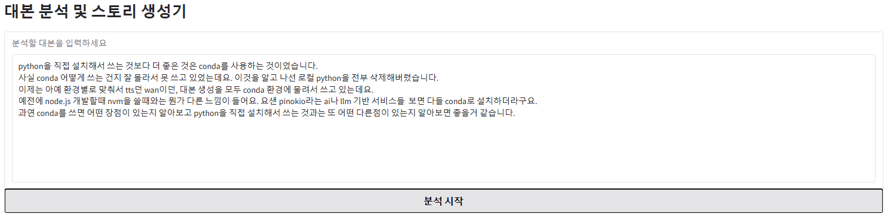

[](./README.md)
[](./README_EN.md)

# 📚 Script Analysis and Story Generator

An application for script analysis and story generation with a four-part narrative structure, powered by AWS Bedrock's Claude 3.5 Sonnet model.

## ✨ Key Features

- 🔍 **Script Analysis**: Analyzes characters, structure, and themes in the input script
- 💬 **Feedback Integration**: Suggests story modifications based on user feedback
- 📝 **Four-Part Story Generation**: Generates introduction, development, turning point, and conclusion independently
- ⚙️ **Customizable Word Count**: Adjust word count for each part between 500-3500 characters
- 📋 **Additional Instructions**: Input custom instructions to guide story generation

## 🛠️ Installation and Setup

### Requirements

- Python 3.8 or higher (confirmed working in conda 3.12 environment)
- AWS account (with Bedrock service access)
- AWS CLI configuration and profile setup
- Claude 3.5 Sonnet model access (ap-northeast-2 region)
- Note: Claude 3.7 Sonnet is only supported in the Virginia region (us-east-1)

## ⏱️ Performance Test Results

Average processing times measured in actual test environments:

* **Story Analysis**: ~20 seconds
* **Story Feedback Integration**: ~20 seconds
* **Story Generation** (2500 characters): ~200 seconds

> Note: Processing times may vary depending on network conditions, AWS Bedrock service status, and input data complexity.

### Installation Steps

1. Clone or download the repository

```bash
git clone [repository URL]
cd [project folder]
```

2. Install required packages

```bash
pip install -r requirements.txt
```

3. Set up environment variables
```bash
cp .env.example .env
```

4. Configure AWS CLI profile (if not already set up)

```bash
aws configure --profile sso
```
Enter the following information:
- AWS Access Key ID
- AWS Secret Access Key
- Default region name (ap-northeast-2 recommended)
- Default output format (json recommended)

We **strongly recommend** using SSO login instead of directly inputting keys to prevent potential key leakage:
```bash
aws sso login
```

## ⚠️ Important Configuration

### AWS Bedrock Model Access

For the application to work properly, the following conditions must be met:

1. **AWS SSO Profile Setup**: The code uses `profile_name='sso'`, so this profile must be configured in AWS CLI. (Can be modified in .env AWS_PROFILE)

2. **Claude 3.5 Sonnet Model Access**: Your AWS account needs access to the "apac.anthropic.claude-3-5-sonnet-20241022-v2:0" model. (Can be modified in .env MODEL_ID; if changing to a different model, complete FM Access in AWS Bedrock and update the MODEL_ID in .env)

3. **Region Verification**: Uses the `ap-northeast-2` (Seoul) region by default. (Can be modified in .env AWS_REGION)

### Changing the Model ID

To use a different model, modify the following section in `app.py`:

```python
response = bedrock.invoke_model(
    modelId=MODEL_ID,  # Change this part
    body=json.dumps({
        "anthropic_version": "bedrock-2023-05-31",
        "max_tokens": 4096,
        "temperature": 0.7,
        "messages": [
            {
                "role": "user",
                "content": prompt
            }
        ]
    })
)
```

## 🚀 Running the Application

Run the following command in the project folder:

```bash
python app.py
```

Once the server starts, access it via `http://127.0.0.1:7860` or the URL displayed in the terminal.

## 💻 How to Use

1. **Script Analysis**
   - Enter your script in the text area
   - Click the "Analyze" button
   - View the analysis of characters, structure, themes, etc.

2. **Provide Feedback**
   - Based on the analysis, enter modifications you'd like to make
   - Click the "Submit Feedback" button
   - View the modified story suggestion
   - Click "Start Story Generation" to proceed to the next step

3. **Story Generation Settings**
   - Adjust the word count for each part (Introduction, Development, Turning Point, Conclusion) using sliders
   - Optionally enter additional instructions and click "Apply Instructions"

4. **Generate the Story**
   - Click the "Generate Introduction", "Generate Development", "Generate Turning Point", and "Generate Conclusion" buttons in order
   - View the generated content in each tab

## 📸 Demo Screenshots

### Script Analysis Screen


### Feedback Input Screen


### Add Story Instructor


### Story Generation Screen


## ❗ Troubleshooting

- **API Call Failure**: Verify that your AWS account permissions and model ID are correct
- **Authentication Error**: Ensure your AWS CLI profile is properly configured
- **Model Limit Exceeded**: Check AWS Bedrock quotas and limitations

## 📄 License

[License Information]

## 🙏 References

- [AWS Bedrock Documentation](https://docs.aws.amazon.com/bedrock/)
- [Claude Model Documentation](https://docs.anthropic.com/claude/docs)
- [Gradio Documentation](https://gradio.app/docs/)